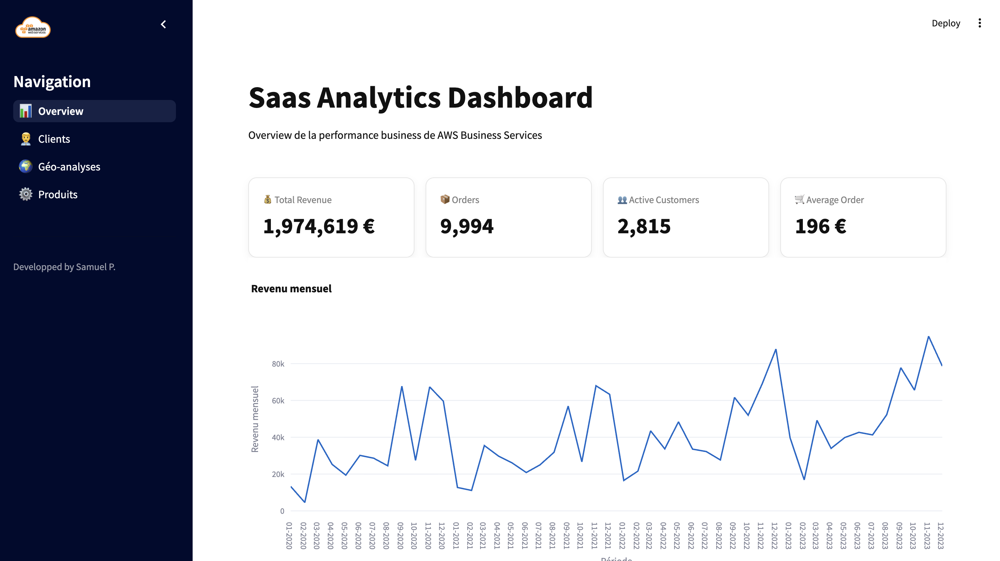
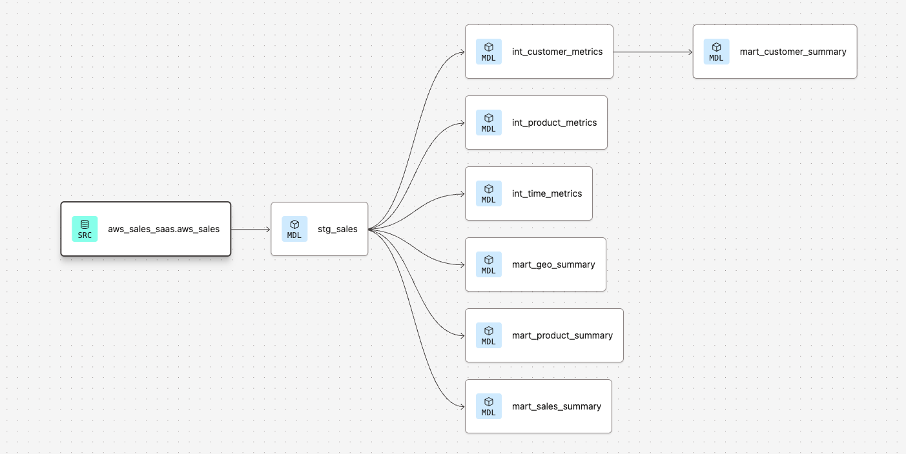

# SaaS Analytics Pipeline

## Project Overview

The **SaaS Analytics Pipeline** is a Python-based analytics project designed to extract, transform, and visualize SaaS business metrics from AWS Business Services (Dataset from Kaggle).  
It includes a **Streamlit app** to explore customer metrics and business KPIs in an interactive and user-friendly interface.

The main purpose of this project is to simulate a production-ready **analytics engineering workflow**, including:

- Data ingestion from Hubspot APIs CRM (fictive)
- ETL pipeline construction with DBT
- Data visualization and dashboards with Streamlit
- Containerization for deployment with Docker



---

## Features

- Interactive dashboards with **Streamlit**
- Analysis of SaaS metrics such as:
  - Customer Lifetime Value (LTV)
  - Churn rate
  - Revenue metrics
- Multi-page Streamlit app for different analytics views
- Fully containerized using **Docker** for easy deployment
- Compatible with Python 3.11

---

## Tech Stack

- **Python 3.11**
- **Pandas, NumPy** – for data manipulation
- **API Hubspot** for simulating extracting data from CRM
- **BigQuery** - To stock dataset and medallion modele from DBT transformation
- **DBT** - For extract from BigQuery, Transform with SQL, Load in BigQuery
- **Streamlit** – for interactive dashboards
- **Docker** – containerization
- **Git/GitHub** – version control

---

## Getting Started

### Prerequisites

- [Python 3.11](https://www.python.org/downloads/)
- [Docker](https://www.docker.com/get-started) (optional if running via container)

---

### Run Locally with Python

1. Clone the repository:

```bash
git clone https://github.com/redpandasdata/aws_saas_analytics.git
cd saas-analytics-pipeline
```

2. Install dependencies (local Python)
```bash
python -m venv .venv
source .venv/bin/activate  # Linux/macOS
.venv\Scripts\activate     # Windows
pip install --upgrade pip setuptools wheel
pip install -r requirements.txt
```

3. Build the Docker image
```bash
docker build -t saas_analytics .
```

4. Running the app using Docker
```bash
docker run -p 8501:8501 saas_analytics
```
Open your browser at http://localhost:8501 to access the dashboard.

### Project structure
```
Saas_analytics_pipeline_aws/
├─ AWS-Logo.png
├─ README.md
├─ app.py
├─ data.ipynb
├─ │   dbt_project.yml
├─ │   │   dbt.log
├─ │   │   .DS_Store
├─ │   │   │   int_customer_metrics.sql
├─ │   │   │   int_product_metrics.sql
├─ │   │   │   int_time_metrics.sql
├─ │   │   │   mart_customer_summary.sql
├─ │   │   │   mart_geo_summary.sql
├─ │   │   │   mart_product_summary.sql
├─ │   │   │   mart_sales_summary.sql
├─ │   │   schema.yml
├─ │   │   │   stg_sales.sql
├─ │   │   catalog.json
├─ │   │   │   │   │   │   int_customer_metrics.sql
├─ │   │   │   │   │   │   int_product_metrics.sql
├─ │   │   │   │   │   │   int_time_metrics.sql
├─ │   │   │   │   │   │   mart_customer_metrics.sql
├─ │   │   │   │   │   │   mart_customer_summary.sql
├─ │   │   │   │   │   │   mart_geo_summary.sql
├─ │   │   │   │   │   │   mart_product_summary.sql
├─ │   │   │   │   │   │   mart_sales_summary.sql
├─ │   │   │   │   │   │   not_null_mart_sales_summary_month.sql
├─ │   │   │   │   │   │   not_null_mart_sales_summary_revenue_month.sql
├─ │   │   │   │   │   │   not_null_mart_sales_summary_year.sql
├─ │   │   │   │   │   │   stg_sales.sql
├─ │   │   graph.gpickle
├─ │   │   graph_summary.json
├─ │   │   index.html
├─ │   │   manifest.json
├─ │   │   partial_parse.msgpack
├─ │   │   run_results.json
├─ │   │   semantic_manifest.json
├─ docker-compose.yml
├─ dockerfile
├─ │   main.py
├─ │   requirements.txt
├─ lineage_dbt.png
├─ pages/
├─ │   customers.py
├─ │   geo.py
├─ │   products.py
├─ requirements.txt
├─ utils/
├─ │   bigquery.py
├─ │   navigation.py
├─ │   theme.py
```


### Author

Samuel – Data Analyst / Analytics Engineer


